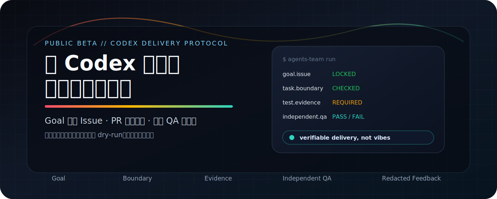

<div align="center">



# Agents-Team

**给 Codex 长任务装一套交付纪律：目标不漂、边界不炸、证据不丢、验收不靠嘴。**

[](CHANGELOG.md)
[](#当前是公开-beta)
[](#开发与验证)
[](plugins/agents-team)
[](#它到底做了什么)

[3 分钟看懂](#3-分钟看懂) · [快速安装](#快速安装) · [10 分钟试用](docs/beta-quickstart.md) · [AGENTS.md 玩法](docs/agents-md-guide.md) · [提交反馈](docs/feedback.md) · [隐私与安全](#隐私与安全承诺) · [使用指南](docs/usage.md)

</div>

## 3 分钟看懂

Codex 已经很会写代码了。

但长任务真正崩掉的地方，往往不是“写不出来”，而是：目标在对话里漂移，范围越做越大，测试证据说不清，下一轮会话又要重新解释项目，最后还是靠一句“应该没问题”。

**Agents-Team 做的事情很直接：把 Codex 的长任务交付，变成一套可以检查、可以复盘、可以持续迭代的协作机制。**

```text
Goal 写进 Issue
改动进入 PR
测试必须有证据
实现者不能自签 QA
高风险任务必须先确认
反馈必须先脱敏，再由用户决定是否提交
```

它不是“再写一段更严厉的 prompt”，而是把提示词、项目规则、Issue/PR 模板、验证脚本、CI 门禁和独立 QA 串成一条交付链。

## 为什么需要它

| 长任务常见事故 | Agents-Team 怎么拦住 |
| --- | --- |
| 目标越聊越散，最后没人记得最初要什么 | Goal、必须完成项和验收门禁写进 Issue，成为任务契约 |
| Codex 顺手改了一堆无关文件 | 任务边界、风险等级和受保护路径进入执行规则 |
| 测试只剩一句“应该没问题” | PR 必须记录命令、退出码、commitSha 和证据链接 |
| 实现者自己说自己通过 | L2/L3 必须由未参与实现的上下文独立 QA |
| 高风险改动被自动化直接推进 | L3 涉及数据、权限、密钥、真实 Provider、生产环境时必须暂停确认 |
| 用户反馈散在聊天里，无法迭代产品 | Beta feedback Issue 模板 + 本地脱敏反馈导出 |

## 它到底做了什么

Agents-Team 给 Codex 项目加上一套 GitHub-first 的协作操作系统：

```text
你提出目标
    ↓
Goal Issue 固化契约
    ↓
Codex 判断 L1 / L2 / L3 风险
    ↓
实现、测试、记录证据
    ↓
Pull Request 汇总最终差异
    ↓
独立 QA：PASS / FAIL / BLOCKED
    ↓
合并，Issue 成为最终记录
```

核心分工很简单：

| 真源 | 管什么 |
| --- | --- |
| GitHub Issue | Goal、必须完成、验收门禁、任务边界、风险等级、依赖与阻塞 |
| Pull Request | 实际差异、测试证据、风险说明、回滚方式 |
| Independent QA | 是否真的满足 Issue，而不是相信实现者叙述 |
| CI Gate | 能机械检查的合同、证据、生命周期和漂移问题 |

## 快速安装

### 方案 A：从 GitHub 安装

适合试用者和普通用户：

```bash
codex plugin marketplace add DOIT-Ben/Agents-Team --ref master
```

重启 Codex，在 Plugin 目录中安装并启用 `agents-team`。随后进入任意 Git 仓库，对 Codex 说：

```text
初始化团队协作机制
```

初始化默认只做 **dry-run**。Codex 会先展示识别到的技术栈、测试命令、准备新增或修改的文件、冲突和未知项；只有你明确确认后才真正写入。

### 方案 B：本地安装

适合贡献者、测试者或想检查源码的人：

```bash
git clone https://github.com/DOIT-Ben/Agents-Team.git
codex plugin marketplace add /absolute/path/to/Agents-Team
```

### 方案 C：命令行验证

适合想先看它会写什么的人：

```bash
python PLUGIN_ROOT/scripts/initialize_project.py /path/to/project
python PLUGIN_ROOT/scripts/initialize_project.py /path/to/project --apply
python PLUGIN_ROOT/scripts/validate_project.py /path/to/project
```

## 当前是公开 Beta

Agents-Team 现在适合 **公开 Beta 试用**，不是让你第一天就扔进不可回滚的生产仓库。

| 建议 | 原因 |
| --- | --- |
| 先选测试仓库或可回滚分支 | 验证它是否适配你的项目结构、测试命令和协作习惯 |
| 先看 dry-run，不急着 apply | 你能看到它准备新增/修改什么，不会静默覆盖 |
| 先跑一个小 L2 Goal | 最快验证 Issue、PR、证据和 QA 是否跑通 |
| 把失败路径反馈回来 | Beta 阶段最需要真实卡点，而不是只收成功案例 |

第一次使用建议走 [10 分钟 Beta 试用](docs/beta-quickstart.md)。

想知道初始化后 `AGENTS.md` 到底怎么约束 Codex、有哪些玩法、怎么验证是否生效，看 [AGENTS.md Guide](docs/agents-md-guide.md)。

## 怎么用

日常口令：

```text
初始化团队协作机制
按照 Issue #123 执行团队目标
独立验收 PR #45
检查团队协作机制
升级团队协作机制
修复团队协作机制
移除团队协作机制
```

风险等级决定自治边界：

| 等级 | 适合什么 | 要求 |
| --- | --- | --- |
| L1 | 局部、可逆、低风险的小改动 | Codex 可以直接处理并自证 |
| L2 | 用户可见功能、跨模块联动、需要 PR 证据的任务 | 必须有 Goal Issue、PR 和独立 QA |
| L3 | 数据、权限、密钥、真实 Provider、生产环境、核心契约 | 实施前必须确认方案，实施后必须独立复核与 QA |

完整命令行用法和行为边界见 [使用指南](docs/usage.md)。

## 怎么反馈

当前最需要的反馈不是“好不好用”，而是这些真实卡点：

| 反馈类型 | 例子 |
| --- | --- |
| 安装问题 | 插件装不上、启用后不显示、manifest 识别异常 |
| 初始化问题 | dry-run 不清楚、技术栈识别错、模板冲突处理不好 |
| 执行问题 | Goal 读取不准、任务边界被扩大、路由阶段不合理 |
| 验收问题 | PR 证据不完整、独立 QA 无法判断、CI 门禁误报 |
| 体验问题 | 文档看不懂、提示太重、失败信息不可操作 |

反馈路径：

1. 对 Codex 说：`提交反馈到 GitHub`，触发 `submit-team-feedback` Skill。
2. Skill 会把用户允许的本地片段、日志摘要或经验沉淀整理成 `Beta feedback` Issue 草稿。
3. 先预览脱敏后的 Issue；只有你确认安全后，才会用 `gh issue create` 提交。

也可以手动使用 GitHub 的 `Beta feedback` Issue 模板。

本地反馈导出默认只预览，不写文件、不上传、不创建 Issue：

```bash
python PLUGIN_ROOT/scripts/export_feedback.py feedback.json --output feedback-redacted.json
```

确认预览无敏感信息后，才使用 `--apply` 写入本地脱敏文件：

```bash
python PLUGIN_ROOT/scripts/export_feedback.py feedback.json --output feedback-redacted.json --apply
```

生成并提交 GitHub Issue 的命令行等价操作：

```bash
python PLUGIN_ROOT/scripts/submit_feedback.py feedback.json
python PLUGIN_ROOT/scripts/submit_feedback.py feedback.json --apply
```

详细字段见 [反馈指南](docs/feedback.md)。

## 隐私与安全承诺

Agents-Team 处理的是开发仓库，所以默认必须保守。

| 承诺 | 说明 |
| --- | --- |
| 不静默上传 | 不会在用户不知道的情况下上传源码、日志、测试输出或仓库内容 |
| 不静默覆盖 | 已有 `AGENTS.md`、GitHub 模板、CI 和项目规则不会被无提示替换 |
| 先预览再写入 | 初始化、升级、修复和移除默认 dry-run，用户确认后才应用 |
| 反馈先脱敏 | 反馈 Issue 默认只生成脱敏草稿，确认后才允许提交到 GitHub |
| 高风险先确认 | L3 触及数据、权限、密钥、真实 Provider 或生产环境时必须暂停 |
| 独立 QA 不伪造 | 没有真正独立上下文，就不能声明独立验收通过 |

隐私边界见 [docs/privacy-feedback.md](docs/privacy-feedback.md)。

## 治理核心与工程能力

| Skill | 作用 |
| --- | --- |
| `initialize-team-collaboration` | 扫描仓库，先预览，再安全生成项目协作适配层 |
| `execute-team-goal` | 按 Goal、风险等级和任务边界执行正式任务 |
| `verify-team-goal` | 在独立上下文中基于证据给出 PASS 或 FAIL |
| `manage-team-collaboration` | 检查漂移、升级、修复或移除机制 |
| `submit-team-feedback` | 把本地反馈、日志摘要和经验沉淀整理成脱敏 GitHub Issue 草稿 |

执行 Goal 时，路由层会根据生命周期和失败状态选择六项内置工程能力：

| Skill | 作用 |
| --- | --- |
| `route-team-work` | 选择阶段、角色、能力提供者和并行策略 |
| `plan-team-goal` | 拆解依赖明确、可独立验证的任务 |
| `build-team-goal` | 在文件边界内测试先行、增量实现 |
| `debug-team-goal` | 复现、定位、修复并留下回归证据 |
| `review-team-goal` | 审查正确性、测试、安全和范围偏差 |
| `ship-team-goal` | 核对当前提交、CI、独立 QA、风险与回滚 |

如果当前环境已经安装兼容的 `addyosmani/agent-skills`，Agents-Team 可以选择对应工程 Skill；没有安装时始终使用内置能力。外部 Skill 不能绕过 Goal、风险、任务边界、独立 QA 或 CI 门禁。

## 仓库结构

```text
Agents-Team/
├── .github/ISSUE_TEMPLATE/       # Beta feedback and repository issue forms
├── .agents/plugins/marketplace.json
├── docs/                         # Public user guides only
│   ├── README.md
│   ├── agents-md-guide.md
│   ├── beta-quickstart.md
│   ├── feedback.md
│   ├── privacy-feedback.md
│   └── assets/agents-team-hero-beta.svg
├── plugins/agents-team/
│   ├── .codex-plugin/plugin.json
│   ├── skills/
│   ├── references/
│   ├── scripts/
│   ├── templates/
│   └── tests/
├── tools/
└── README.md
```

## 开发与验证

```bash
cd plugins/agents-team
python -m unittest discover -s tests -v

cd ../..
python tools/build_distribution.py
python tools/verify_distribution.py dist/agents-team-0.3.0.zip
```

当前测试覆盖 Python、Next.js、.NET、Monorepo、既有 `AGENTS.md` 和既有 CI 等初始化场景，并检查合同、证据、生命周期、路由、角色边界、路径穿越、符号链接、反馈脱敏和分发包完整性。

## 边界

Agents-Team 不替代产品决策，也不会凭空知道项目真正的验收标准。无法可靠识别的测试命令仍需要负责人确认；GitHub 分支保护等仓库级设置也需要相应权限。

它真正做的，是把人和 Codex 之间容易丢失的约定，变成项目中看得见、跑得动、验得过的工程制度。

## 许可

Copyright © 2026 DOIT-Ben. 当前版本保留所有权利，具体条款见 [LICENSE](LICENSE)。
