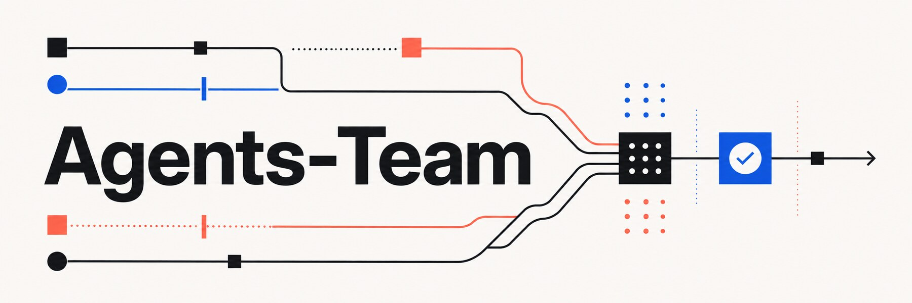

<div align="center">



# Agents-Team

**让 Codex 不只是“写代码”，而是围绕目标持续推进、接受验收、完成交付。**

[](CHANGELOG.md)
[](#开发与验证)
[](plugins/agents-team)
[](#一条完整的交付链路)

[快速开始](#快速开始) · [它适合谁](#它适合谁) · [交付链路](#一条完整的交付链路) · [使用指南](docs/usage.md) · [设计规范](docs/superpowers/specs/2026-06-29-agents-team-design.md)

</div>

## Codex 会写代码，但长项目缺的不是代码

一句“帮我把这个系统做完”，很容易变成一串看似繁忙、实际上不可验收的修改：目标在对话里漂移，范围越做越大，测试被一句“应该没问题”带过，下一次会话又重新理解项目。

Agents-Team 给项目补上的，是一套可以落地、可以检查、可以复用的协作操作系统：

- **目标写进 Issue**：Goal、必须完成项、验收门禁和任务边界都成为正式契约。
- **过程交给 Codex**：主 Codex 自主拆解和执行，只有关键风险才打断你确认。
- **结果必须举证**：测试没有通过、证据不完整、越过边界，就不能宣布完成。
- **结论回到 GitHub**：Issue 和 PR 是任务、进度与验收结论的唯一动态真源。

它不是一组“请认真工作”的提示词，而是提示词、项目规则、模板、验证器和 CI 门禁共同组成的机制。

## 它适合谁

Agents-Team 首先服务于这样的团队：

> **项目负责人 + 主 Codex + 按任务临时调用的子智能体**

特别适合长任务、系统开发、跨模块改造和需要多轮会话持续推进的项目。对于十分钟能完成的小改动，它不会强迫你开一场流程大会。

## 一条完整的交付链路

```text
你提出目标
    ↓
Goal Issue 固化契约
    ↓
Codex 判断 L1 / L2 / L3 风险
    ↓
实现、测试、记录证据
    ↓
Pull Request 汇总最终差异
    ↓
独立 QA：PASS / FAIL
    ↓
合并，Issue 成为最终记录
```

### Issue 不是愿望清单

每个正式任务都按固定顺序回答六个问题：

| 区块 | 必须说清楚什么 |
| --- | --- |
| **Goal** | 最终要改变什么结果 |
| **必须完成** | 哪些结果缺一不可 |
| **验收门禁** | 用什么测试、命令或证据判定完成 |
| **任务边界** | 明确禁止修改和顺手扩张的内容 |
| **风险等级** | L1、L2 或 L3 |
| **依赖与阻塞** | 缺少哪些条件就必须暂停 |

### 风险决定自治边界

- **L1 常规任务**：Codex 可以自主完成并自证。
- **L2 重要任务**：必须走 PR，并由未参与实现的上下文独立验收。
- **L3 关键任务**：涉及数据、权限、核心契约、密钥、费用、真实 Provider 或生产环境。设计先确认，结果再独立验收。

这套分级解决的是一个实际矛盾：全部询问会把自动化拖死，全部放权又会把风险藏进提交里。

## 治理核心与工程能力

| Skill | 作用 |
| --- | --- |
| `initialize-team-collaboration` | 扫描仓库，先预览，再安全生成项目协作适配层 |
| `execute-team-goal` | 按 Goal、风险等级和任务边界执行正式任务 |
| `verify-team-goal` | 在独立上下文中基于证据给出 PASS 或 FAIL |
| `manage-team-collaboration` | 检查漂移、升级、修复或移除机制 |

执行 Goal 时，路由层会根据生命周期和失败状态选择六项内置工程能力：

| Skill | 作用 |
| --- | --- |
| `route-team-work` | 选择阶段、角色、能力提供者和并行策略 |
| `plan-team-goal` | 拆解依赖明确、可独立验证的任务 |
| `build-team-goal` | 在文件边界内测试先行、增量实现 |
| `debug-team-goal` | 复现、定位、修复并留下回归证据 |
| `review-team-goal` | 审查正确性、测试、安全和范围偏差 |
| `ship-team-goal` | 核对当前提交、CI、独立 QA、风险与回滚 |

如果当前环境已经安装兼容的 `addyosmani/agent-skills`，Agents-Team 可以选择对应工程 Skill；没有安装时始终使用内置能力。外部 Skill 不能绕过 Goal、风险、任务边界、独立 QA 或 CI 门禁。

初始化后，项目会得到项目级 `AGENTS.md` 规则、`.codex/team-collaboration.json` 配置、Issue/PR 模板、验证脚本和可选 CI 门禁。已有文件不会被静默覆盖。

## 快速开始

### 从 GitHub 安装

```bash
codex plugin marketplace add DOIT-Ben/Agents-Team --ref master
```

重启 Codex，在 Plugin 目录中安装并启用 `agents-team`。随后进入任意 Git 仓库，对 Codex 说：

```text
初始化团队协作机制
```

初始化默认只做 **dry-run**。Codex 会先展示识别到的技术栈、测试命令、准备新增或修改的文件、冲突和未知项；只有你明确确认后才真正写入。

首次安装有一个明确的 bootstrap 步骤：先创建 Draft PR，再向该分支推送一个经过审查的提交，由 `synchronize` 事件验证 Issue、当前 head 证据和 QA 契约。修正 PR 正文时由 `edited` 事件针对同一 head 复验，不需要制造新提交。

### 本地安装

```bash
git clone https://github.com/DOIT-Ben/Agents-Team.git
codex plugin marketplace add /absolute/path/to/Agents-Team
```

### 日常口令

```text
按照 Issue #123 执行团队目标
独立验收 PR #45
检查团队协作机制
升级团队协作机制
修复团队协作机制
移除团队协作机制
```

完整命令行用法和行为边界见 [使用指南](docs/usage.md)。

## 安全原则

- 初始化、升级、修复和移除都先预览，写入必须获得明确确认。
- 不覆盖已有 `AGENTS.md`、GitHub 模板或业务 CI。
- 初始化必须基于完整仓库检出；禁止用缺少既有文件的空投影生成适配器。
- Hook 只做只读状态检测，不执行项目命令，也不修改仓库。
- 没有真正独立的验收上下文，就不能伪造“独立 QA”。
- 文字规则不能保证绝对服从，能机械检查的要求必须交给测试、验证器和 CI。

## 仓库结构

```text
Agents-Team/
├── .agents/plugins/marketplace.json
├── plugins/agents-team/
│   ├── .codex-plugin/plugin.json
│   ├── skills/
│   ├── references/
│   ├── scripts/
│   ├── templates/
│   └── tests/
├── docs/
├── tools/
└── README.md
```

## 开发与验证

```bash
cd plugins/agents-team
python3 -m unittest discover -s tests -v

cd ../..
python3 tools/build_distribution.py
python3 tools/verify_distribution.py dist/agents-team-0.3.0.zip
```

当前测试覆盖 Python、Next.js、.NET、Monorepo、既有 `AGENTS.md` 和既有 CI 等初始化场景，并检查合同、证据、生命周期、路由、角色边界、路径穿越、符号链接和分发包完整性。

## 边界

Agents-Team 不替代产品决策，也不会凭空知道项目真正的验收标准。无法可靠识别的测试命令仍需要负责人确认；GitHub 分支保护等仓库级设置也需要相应权限。

它真正做的，是把人和 Codex 之间容易丢失的约定，变成项目中看得见、跑得动、验得过的工程制度。

## 许可

Copyright © 2026 DOIT-Ben. 当前版本保留所有权利，具体条款见 [LICENSE](LICENSE)。
